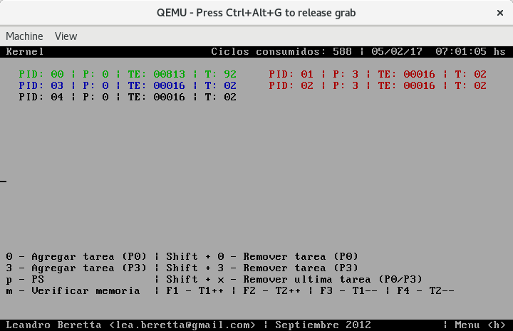

# kernel-ia-32e

Kernel Multitasking (IA-32e) desarrollado para la matería Técnicas Digitales III (UTN-FRBA) de Ingeniería Electrónica.

Autor: Leandro Beretta <lea.beretta@gmail.com> | Septiembre 2012

## Modo de uso

    # Compilar el kernel

    make

    # Luego de compilar, ejecutar con QEMU (la imagen es disk.img)

    qemu-system-x86_64 -drive format=raw,file=disk.img,index=0,if=floppy

## Aclaraciones

* La interrupción elegida para realizar las system calls fue la 80h
* Cada tarea imprime su información en pantalla
* La tarea inicial es la idle, que en principio tiene un timeframe de 92ms (Timeframe total = 100ms) ya que inicialmente también se agregan las tareas 1, 2, ps y verificacion de memoria (2 ticks cada una)
